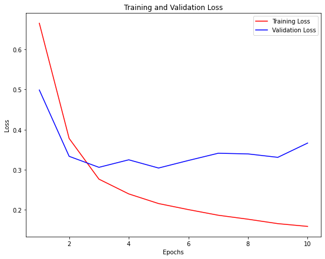
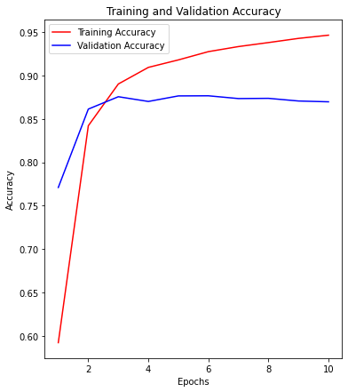

## 基于LSTM神经网络模型的电影评论文本情感分类


```python
import re
from bs4 import BeautifulSoup
import pandas as pd
import csv
import tensorflow as tf
import numpy as np
import matplotlib.pyplot as plt
```


```python
tf.device('/gpu:1')
train_csv=pd.read_csv('data_train.csv')
train_csv
```


<div>
<style scoped>
    .dataframe tbody tr th:only-of-type {
        vertical-align: middle;
    }

    .dataframe tbody tr th {
        vertical-align: top;
    }

    .dataframe thead th {
        text-align: right;
    }
</style>
<table border="1" class="dataframe">
  <thead>
    <tr style="text-align: right;">
      <th></th>
      <th>影评内容</th>
      <th>真实标签</th>
    </tr>
  </thead>
  <tbody>
    <tr>
      <th>0</th>
      <td>Bromwell High is a cartoon comedy. It ran at t...</td>
      <td>1</td>
    </tr>
    <tr>
      <th>1</th>
      <td>Homelessness (or Houselessness as George Carli...</td>
      <td>1</td>
    </tr>
    <tr>
      <th>2</th>
      <td>Brilliant over-acting by Lesley Ann Warren. Be...</td>
      <td>1</td>
    </tr>
    <tr>
      <th>3</th>
      <td>This is easily the most underrated film inn th...</td>
      <td>1</td>
    </tr>
    <tr>
      <th>4</th>
      <td>This is not the typical Mel Brooks film. It wa...</td>
      <td>1</td>
    </tr>
    <tr>
      <th>...</th>
      <td>...</td>
      <td>...</td>
    </tr>
    <tr>
      <th>24995</th>
      <td>Towards the end of the movie, I felt it was to...</td>
      <td>0</td>
    </tr>
    <tr>
      <th>24996</th>
      <td>This is the kind of movie that my enemies cont...</td>
      <td>0</td>
    </tr>
    <tr>
      <th>24997</th>
      <td>I saw 'Descent' last night at the Stockholm Fi...</td>
      <td>0</td>
    </tr>
    <tr>
      <th>24998</th>
      <td>Some films that you pick up for a pound turn o...</td>
      <td>0</td>
    </tr>
    <tr>
      <th>24999</th>
      <td>This is one of the dumbest films, I've ever se...</td>
      <td>0</td>
    </tr>
  </tbody>
</table>
<p>25000 rows × 2 columns</p>
</div>


```python
test_csv=pd.read_csv('data_test.csv')
test_csv
```


<div>
<style scoped>
    .dataframe tbody tr th:only-of-type {
        vertical-align: middle;
    }

    .dataframe tbody tr th {
        vertical-align: top;
    }

    .dataframe thead th {
        text-align: right;
    }
</style>
<table border="1" class="dataframe">
  <thead>
    <tr style="text-align: right;">
      <th></th>
      <th>影评内容</th>
      <th>真实标签</th>
    </tr>
  </thead>
  <tbody>
    <tr>
      <th>0</th>
      <td>I went and saw this movie last night after bei...</td>
      <td>1</td>
    </tr>
    <tr>
      <th>1</th>
      <td>Actor turned director Bill Paxton follows up h...</td>
      <td>1</td>
    </tr>
    <tr>
      <th>2</th>
      <td>As a recreational golfer with some knowledge o...</td>
      <td>1</td>
    </tr>
    <tr>
      <th>3</th>
      <td>I saw this film in a sneak preview, and it is ...</td>
      <td>1</td>
    </tr>
    <tr>
      <th>4</th>
      <td>Bill Paxton has taken the true story of the 19...</td>
      <td>1</td>
    </tr>
    <tr>
      <th>...</th>
      <td>...</td>
      <td>...</td>
    </tr>
    <tr>
      <th>24995</th>
      <td>I occasionally let my kids watch this garbage ...</td>
      <td>0</td>
    </tr>
    <tr>
      <th>24996</th>
      <td>When all we have anymore is pretty much realit...</td>
      <td>0</td>
    </tr>
    <tr>
      <th>24997</th>
      <td>The basic genre is a thriller intercut with an...</td>
      <td>0</td>
    </tr>
    <tr>
      <th>24998</th>
      <td>Four things intrigued me as to this film - fir...</td>
      <td>0</td>
    </tr>
    <tr>
      <th>24999</th>
      <td>David Bryce's comments nearby are exceptionall...</td>
      <td>0</td>
    </tr>
  </tbody>
</table>
<p>25000 rows × 2 columns</p>
</div>


```python
# 文本预处理
def review_to_wordlist(review):
    review_text = BeautifulSoup(review, "html.parser").get_text()
    review_text = re.sub("[^a-zA-Z]"," ", review_text)
    # 转为小写
    words = review_text.lower().split()
    return words
```


```python
train_label = train_csv['真实标签']
y_train=train_label.values
train_texts = []
for i in range(len(train_csv['影评内容'])):
    train_texts.append(' '.join(review_to_wordlist(train_csv['影评内容'][i])))
print('影评内容：')
# 看一条训练集的影评内容
print(train_texts[3])
print('真实标签：')
print(y_train)
```

    影评内容：
    this is easily the most underrated film inn the brooks cannon sure its flawed it does not give a realistic view of homelessness unlike say how citizen kane gave a realistic view of lounge singers or titanic gave a realistic view of italians you idiots many of the jokes fall flat but still this film is very lovable in a way many comedies are not and to pull that off in a story about some of the most traditionally reviled members of society is truly impressive its not the fisher king but its not crap either my only complaint is that brooks should have cast someone else in the lead i love mel as a director and writer not so much as a lead
    真实标签：
    [1 1 1 ... 0 0 0]
    


```python
test_label=test_csv['真实标签']
y_test=test_label.values
test_texts = []
for i in range(len(test_csv['影评内容'])):
    test_texts.append(' '.join(review_to_wordlist(test_csv['影评内容'][i])))
print('影评内容：')
# 看一条测试集的影评内容
print(test_texts[3])
print('真实标签：')
print(y_test)
```

    影评内容：
    i saw this film in a sneak preview and it is delightful the cinematography is unusually creative the acting is good and the story is fabulous if this movie does not do well it won t be because it doesn t deserve to before this film i didn t realize how charming shia lebouf could be he does a marvelous self contained job as the lead there s something incredibly sweet about him and it makes the movie even better the other actors do a good job as well and the film contains moments of really high suspense more than one might expect from a movie about golf sports movies are a dime a dozen but this one stands out this is one i d recommend to anyone
    真实标签：
    [1 1 1 ... 0 0 0]
    


```python
# Tokenizer是一个用于向量化文本，或将文本转换为序列（即单词在字典中的下标构成的列表，从1算起）的类。
# Tokenizer其具体的功能是把一个词（中文单个字或者词组认为是一个词）转化为一个正整数，于是一个文本就变成了一个序列。
# Tokenizer实际上只是生成了一个字典，并且统计了词频等信息，并没有把文本转成需要的向量表示。
token=tf.keras.preprocessing.text.Tokenizer(num_words=4000)
token.fit_on_texts(train_texts)
word_index = token.word_index
```


```python
# 将句子转换成单词索引序列
train_sequences=token.texts_to_sequences(train_texts)
test_sequences=token.texts_to_sequences(test_texts)
```


```python
print(train_texts[3])
```

    this is easily the most underrated film inn the brooks cannon sure its flawed it does not give a realistic view of homelessness unlike say how citizen kane gave a realistic view of lounge singers or titanic gave a realistic view of italians you idiots many of the jokes fall flat but still this film is very lovable in a way many comedies are not and to pull that off in a story about some of the most traditionally reviled members of society is truly impressive its not the fisher king but its not crap either my only complaint is that brooks should have cast someone else in the lead i love mel as a director and writer not so much as a lead
    


```python
print(train_sequences[3])
```

    [10, 6, 692, 1, 89, 2161, 19, 1, 2815, 248, 91, 3001, 7, 125, 23, 199, 3, 804, 633, 4, 1000, 132, 86, 3530, 3339, 509, 3, 804, 633, 4, 41, 2549, 509, 3, 804, 633, 4, 21, 3707, 108, 4, 1, 622, 788, 1011, 18, 130, 10, 19, 6, 54, 3174, 8, 3, 93, 108, 1259, 25, 23, 2, 5, 1572, 11, 122, 8, 3, 62, 43, 48, 4, 1, 89, 1039, 4, 878, 6, 364, 1133, 91, 23, 1, 3443, 601, 18, 91, 23, 580, 341, 59, 63, 3264, 6, 11, 2815, 142, 27, 176, 278, 325, 8, 1, 475, 9, 114, 3685, 14, 3, 156, 2, 532, 23, 36, 73, 14, 3, 475]
    


```python
# keras只能接受长度相同的序列输入。因此如果目前序列长度参差不齐，这时需要使用pad_sequences()。
# 该函数是将序列转化为经过填充以后的一个长度相同的新序列新序列。
x_train=tf.keras.preprocessing.sequence.pad_sequences(train_sequences,padding='post',truncating='post',maxlen=400)
x_test=tf.keras.preprocessing.sequence.pad_sequences(test_sequences,padding='post',truncating='post',maxlen=400)
```


```python
print(x_train)
print(y_train)
```

    [[307   6   3 ...   0   0   0]
     [ 41  14 707 ...   0   0   0]
     [518 118 112 ...   0   0   0]
     ...
     [  9 216 231 ...   0   0   0]
     [ 48 106  11 ...   0   0   0]
     [ 10   6  29 ...   0   0   0]]
    [1 1 1 ... 0 0 0]
    


```python
index = np.arange(25000) 
# 将索引进行打乱
np.random.shuffle(index)
print(x_train[index]) 
print(y_train[index])
```

    [[   9  429    5 ...    0    0    0]
     [ 996  734 2670 ...   55    1  577]
     [2713 2348   90 ...    0    0    0]
     ...
     [ 383  176 1032 ...    0    0    0]
     [   1   17   46 ...    0    0    0]
     [ 548 1678 1240 ...    0    0    0]]
    [0 1 1 ... 0 1 1]
    


```python
# 设计神经网络，Sequential顺序模型是多个网络层的线性堆叠
model=tf.keras.models.Sequential([
    # Embedding将正整数（索引值）转换为固定尺寸的稠密向量。
    tf.keras.layers.Embedding(output_dim=64,input_dim=4000,input_length=400),
    # LSTM输出空间维度为64，Bidirectional为RNN的双向封装器，对序列进行前向和后向计算。
    tf.keras.layers.Bidirectional(tf.keras.layers.LSTM(64)),
    # 全连接层
    tf.keras.layers.Dense(64, activation='relu'),
    tf.keras.layers.Dropout(0.2),
    tf.keras.layers.Dense(1,activation='sigmoid')
])
```


```python
adam = tf.keras.optimizers.Adam(lr=0.0001,epsilon=1e-08, decay=0.0)
# 配置学习过程,使用adam优化器,binary_crossentropy二进制交叉熵用于二分类问题中
model.compile(optimizer=adam,
              loss='binary_crossentropy',
              metrics=['accuracy'])
```


```python
# 进行模型的训练
history = model.fit(x_train[index],y_train[index],
                    # validation_split为用作验证集的训练数据的比例
                    validation_split=0.3,
                     epochs=10,batch_size=56,verbose=1,shuffle=True)
```

    Epoch 1/10
    313/313 [==============================] - 15s 47ms/step - loss: 0.6653 - accuracy: 0.5919 - val_loss: 0.4989 - val_accuracy: 0.7709
    Epoch 2/10
    313/313 [==============================] - 14s 45ms/step - loss: 0.3782 - accuracy: 0.8421 - val_loss: 0.3336 - val_accuracy: 0.8613
    Epoch 3/10
    313/313 [==============================] - 14s 46ms/step - loss: 0.2767 - accuracy: 0.8903 - val_loss: 0.3062 - val_accuracy: 0.8756
    Epoch 4/10
    313/313 [==============================] - 14s 45ms/step - loss: 0.2399 - accuracy: 0.9094 - val_loss: 0.3249 - val_accuracy: 0.8701
    Epoch 5/10
    313/313 [==============================] - 14s 45ms/step - loss: 0.2159 - accuracy: 0.9181 - val_loss: 0.3044 - val_accuracy: 0.8765
    Epoch 6/10
    313/313 [==============================] - 14s 45ms/step - loss: 0.2008 - accuracy: 0.9276 - val_loss: 0.3232 - val_accuracy: 0.8767
    Epoch 7/10
    313/313 [==============================] - 14s 45ms/step - loss: 0.1868 - accuracy: 0.9334 - val_loss: 0.3412 - val_accuracy: 0.8735
    Epoch 8/10
    313/313 [==============================] - 14s 45ms/step - loss: 0.1768 - accuracy: 0.9381 - val_loss: 0.3396 - val_accuracy: 0.8737
    Epoch 9/10
    313/313 [==============================] - 14s 45ms/step - loss: 0.1658 - accuracy: 0.9429 - val_loss: 0.3310 - val_accuracy: 0.8707
    Epoch 10/10
    313/313 [==============================] - 14s 45ms/step - loss: 0.1589 - accuracy: 0.9466 - val_loss: 0.3667 - val_accuracy: 0.8697
    


```python
# 保存模型权重参数
model.save_weights('./imdb-classify-lstm/finalmodel')
```


```python
model.load_weights('./imdb-classify-lstm/finalmodel')
```


    <tensorflow.python.training.tracking.util.CheckpointLoadStatus at 0x151e675d320>


```python
# model.fit方法返回一个History回调，它具有包含连续误差的列表和其他度量的history属性
train_acc = history.history['accuracy']
val_acc = history.history['val_accuracy']
train_loss = history.history['loss']
val_loss = history.history['val_loss']

epochs=range(1,len(train_acc)+1)
plt.figure(figsize=(9,7))
# 画出损失函数曲线
plt.plot(epochs,train_loss,'r',label='Training Loss')
plt.plot(epochs,val_loss,'b',label='Validation Loss')
plt.title('Training and Validation Loss')
plt.xlabel('Epochs')
plt.ylabel('Loss')
plt.legend()
plt.show()
```


    

    


```python
plt.clf()  
plt.figure(figsize=(6,7))
# 画出准确率曲线
plt.plot(epochs,train_acc,'r',label='Training Accuracy')
plt.plot(epochs,val_acc,'b',label='Validation Accuracy')
plt.title('Training and Validation Accuracy')
plt.xlabel('Epochs')
plt.ylabel('Accuracy')
plt.legend()
plt.show()
```


    <Figure size 432x288 with 0 Axes>


    

    


```python
# evaluate在测试模式下返回模型的误差值和评估标准值
test_loss,test_acc=model.evaluate(x_test,y_test,verbose=1)
print('Test Loss: {}'.format(test_loss))
print('Test Accuracy: {}'.format(test_acc))
```

    782/782 [==============================] - 10s 13ms/step - loss: 0.3780 - accuracy: 0.8626
    Test Loss: 0.37803682684898376
    Test Accuracy: 0.862559974193573
    


```python
# 对测试集进行预测
predictions=model.predict(x_test)
predictions[0]
```


    array([0.98488533], dtype=float32)


```python
# 将预测结果写入csv文件
with open('result_prediction.csv', 'w',encoding='utf-8-sig',newline='') as csvfile:
    fieldnames = ['影评内容', '真实标签','预测标签']
    # 以字典形式写入
    writer = csv.DictWriter(csvfile, fieldnames=fieldnames)

    writer.writeheader()
    # 将真实标签和预测结果的标签逐条写入
    for i in range(len(test_texts)):
        writer.writerow({'影评内容': test_texts[i], '真实标签': y_test[i],'预测标签': predictions[i][0]})
  
```


```python
df=pd.read_csv('result_prediction.csv')
df
```


<div>
<style scoped>
    .dataframe tbody tr th:only-of-type {
        vertical-align: middle;
    }

    .dataframe tbody tr th {
        vertical-align: top;
    }

    .dataframe thead th {
        text-align: right;
    }
</style>
<table border="1" class="dataframe">
  <thead>
    <tr style="text-align: right;">
      <th></th>
      <th>影评内容</th>
      <th>真实标签</th>
      <th>预测标签</th>
    </tr>
  </thead>
  <tbody>
    <tr>
      <th>0</th>
      <td>i went and saw this movie last night after bei...</td>
      <td>1</td>
      <td>0.984885</td>
    </tr>
    <tr>
      <th>1</th>
      <td>actor turned director bill paxton follows up h...</td>
      <td>1</td>
      <td>0.986985</td>
    </tr>
    <tr>
      <th>2</th>
      <td>as a recreational golfer with some knowledge o...</td>
      <td>1</td>
      <td>0.988867</td>
    </tr>
    <tr>
      <th>3</th>
      <td>i saw this film in a sneak preview and it is d...</td>
      <td>1</td>
      <td>0.992610</td>
    </tr>
    <tr>
      <th>4</th>
      <td>bill paxton has taken the true story of the us...</td>
      <td>1</td>
      <td>0.996433</td>
    </tr>
    <tr>
      <th>...</th>
      <td>...</td>
      <td>...</td>
      <td>...</td>
    </tr>
    <tr>
      <th>24995</th>
      <td>i occasionally let my kids watch this garbage ...</td>
      <td>0</td>
      <td>0.013047</td>
    </tr>
    <tr>
      <th>24996</th>
      <td>when all we have anymore is pretty much realit...</td>
      <td>0</td>
      <td>0.040842</td>
    </tr>
    <tr>
      <th>24997</th>
      <td>the basic genre is a thriller intercut with an...</td>
      <td>0</td>
      <td>0.163474</td>
    </tr>
    <tr>
      <th>24998</th>
      <td>four things intrigued me as to this film first...</td>
      <td>0</td>
      <td>0.040424</td>
    </tr>
    <tr>
      <th>24999</th>
      <td>david bryce s comments nearby are exceptionall...</td>
      <td>0</td>
      <td>0.980850</td>
    </tr>
  </tbody>
</table>
<p>25000 rows × 3 columns</p>
</div>


```python
# 展示文本预测结果
def display_test_sentiment(text):
    
    print(text)
    # 对输入文本进行预处理
    newtext=review_to_wordlist(text)
    # 将句子转换成单词索引序列
    input_seq=token.texts_to_sequences([newtext])
    # 将序列转化为经过填充以后的一个长度相同的新序列新序列
    pad_input_seq=tf.keras.preprocessing.sequence.pad_sequences(input_seq,
                                                   padding='post',
                                                   truncating='post',
                                                   maxlen=400)
    # 使用训练好的模型进行预测
    pred=model.predict(pad_input_seq)
    print(pred[0][0])
    # 如果预测值大于o.5预测为积极
    if pred[0][0]>0.5:
        preValue='positive'
    else:
        preValue='negtive'
    print('predict value:',preValue)
```


```python
review_text="There is no better way to give tribute to a genuinely amazing actor. The film was pretty emotional and touching. Such natural acting from #Sushanth and #SanjanaSanghi and a brilliant execution from other the cast and crew. The movie indeed had plot holes and rushed up situations but I don't think anyone will notice those stuffs as the movie maintained a emotionally touching storyline and knowing the fact that Sushanth left us made it way more emotional and can't finish the movie without releasing a single drop of tear."
display_test_sentiment(review_text)
```

    There is no better way to give tribute to a genuinely amazing actor. The film was pretty emotional and touching. Such natural acting from #Sushanth and #SanjanaSanghi and a brilliant execution from other the cast and crew. The movie indeed had plot holes and rushed up situations but I don't think anyone will notice those stuffs as the movie maintained a emotionally touching storyline and knowing the fact that Sushanth left us made it way more emotional and can't finish the movie without releasing a single drop of tear.
    0.98576975
    predict value: positive
    


```python
review_text="This movie has potential but everything goes to heck because of the extremely bad script. First, you need to wait almost 60 minutes of 90 to see something interesting. Second, when the action starts everything goes extremely fast. Shia's character was barely developed. Are you serious? Last, Fx's look cheap and acting amateurish, except from Shia. But...So, overall a wasted opportunity to create a great movie. Shame on Director 's and writers. Make yourself a favor and watch Sicario 1 and 2 instead watching this one."
display_test_sentiment(review_text)
```

    This movie has potential but everything goes to heck because of the extremely bad script. First, you need to wait almost 60 minutes of 90 to see something interesting. Second, when the action starts everything goes extremely fast. Shia's character was barely developed. Are you serious? Last, Fx's look cheap and acting amateurish, except from Shia. But...So, overall a wasted opportunity to create a great movie. Shame on Director 's and writers. Make yourself a favor and watch Sicario 1 and 2 instead watching this one.
    0.0034927009
    predict value: negtive
    
